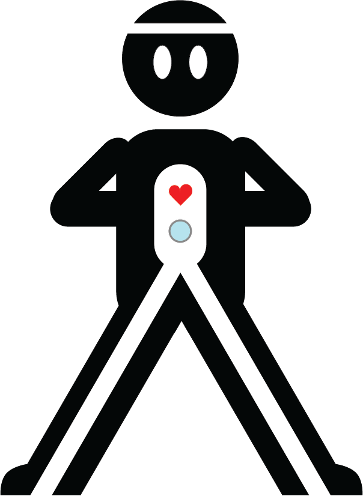

# tripodvideoninja

Personal videography site created using Jekyll, built and hosted by [Netlify](https://www.netlify.com), and provided via [Hover](https://www.hover.com).

## Running Locally

To install all necessary dependencies on your machine, first run `bundle install`.

To run the localhost server, use `bundle exec jekyll --serve`.
